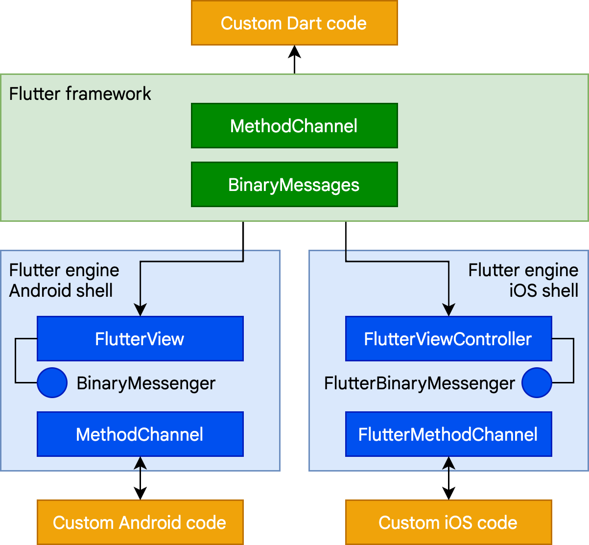

<div align="center">


## Fluttter Deep Learning - FlutterBigShop
</div>

---

<p align="center"> Flutter Eğitimi için Kullanılacak Uygulama
    <br> 
</p>


## Widget Architectural - Stateless and Statesfull widget

Flutter, iOS ve Android gibi işletim sistemlerinde kodun yeniden kullanılmasına izin verirken aynı zamanda uygulamaların temel platform hizmetleriyle doğrudan arayüz oluşturmasına izin vermek için tasarlanmış platformlar arası bir UI araç takımıdır.

Geliştirme sırasında Flutter uygulamaları, tam bir yeniden derlemeye ihtiyaç duymadan değişikliklerin durum bilgili çalışırken yeniden yüklenmesini sağlayan bir sanal makinede çalışır. Doğrudan makine koduna veya web'i hedefliyorsa JavaScript'e derlenir.

Flutter, izin verilen bir BSD lisansı olup temel kitaplık işlevselliğini tamamlayan üçüncü taraf paketlerden oluşan bir ekosisteme sahiptir.

### Architectural 

Flutter genişletilebilir, katmanlı bir sistem olarak tasarlanmıştır. Her biri alttaki katmana bağlı olan bir dizi bağımsız kitaplık olarak bulunur.

Her katman aşağıdaki katmana eşit derecede erişimi vardır.


Flutter'ın temelinde, çoğunlukla C++ ile yazılmış olan ve tüm Flutter uygulamalarını desteklemek için gerekli ilkelleri destekleyen Flutter engine bulunur. Engine, yeni bir framein boyanması gerektiğinde birleştirilmiş sahnelerin rasterleştirilmesinden sorumludur.Grafikler (Skia aracılığıyla), metin düzeni, dosya ve ağ G/Ç, erişilebilirlik desteği, eklenti mimarisi ve bir Dart çalışma zamanı ve derleme araç zinciri dahil olmak üzere Flutter'ın temel API'sinin düşük seviyeli uygulamasını sağlar.

Geliştiriciler, Flutter ile Dart dilinde yazılmış modern, reaktif bir çerçeve sağlayan Flutter çerçevesi aracılığıyla etkileşime girer.

- Basit temel sınıflar ve yapıcı blok servisler üzerinden yaygın olarak kullanılan aanimation, painting ve gestures gibi yapı taşı hizmetleri.

- Rendering layer, layout ile ilgilenmek için bir soyutlama sağlar. Bu katmanla, işlenebilir nesnelerden oluşan bir ağaç oluşturabilirsiniz. Değişikliklerinizi yansıtmak için düzeni otomatik olarak güncelleyen ağaç ile bu nesneleri dinamik olarak değiştirebilirsiniz.

- Widget katmanı, işleme katmanındaki her işleme nesnesine karşılık gelen bir sınıfa sahiptir.Bu, reaktif programlama modelinin tanıtıldığı katmandır.

- Material ve Cupertino kitaplıkları, Material veya iOS tasarım dillerini uygulamak için widget katmanının kompozisyon ilkellerini kullanan kapsamlı kontrol setleri sunar.

- Flutter framework  nispeten küçüktür; geliştiricilerin kullanabileceği birçok üst düzey özellik, kamera ve web görünümü gibi platform eklentilerinin yanı sıra characters, http ve temel Dart ve Flutter kitaplıkları üzerine inşa edilen animasyonlar gibi platformdan bağımsız özellikler dahil olmak üzere paketler halinde uygulanır.Bu paketlerden bazıları, uygulama içi ödemeler, Apple kimlik doğrulaması ve animasyonlar gibi hizmetleri kapsayan daha geniş bir ekosistemden gelir.

### Uygulamaların Anatomisi

<br>
<div align=center >

</div>

Dart Uygulaması
 - Widget'ları istenen kullanıcı arabiriminde oluşturur.
 - İş mantığını uygular.

Framework
- Yüksek kaliteli uygulamalar (hareket algılama, erişilebilirlik, metin girişi) oluşturmak için üst düzey API sağlar.
- Uygulamanın widget ağacını bir sahnede birleştirir.

Engine

- Birleştirilmiş sahnelerin rasterleştirilmesinden sorumludur.
- Flutter'ın temel API'lerinin düşük düzeyde uygulanmasını sağlar. (örneğin, grafikler, metin düzeni, Dart çalışma zamanı).
- Dart:ui API'sini kullanarak işlevselliğini frameworke sunar.
- Engine'in Embedder API'sini kullanarak belirli bir platformla bütünleşir.

Embedder

- İşleme yüzeyleri, erişilebilirlik ve girdi gibi hizmetlere erişim için temeldeki işletim sistemiyle koordinasyon sağlar.
- Olay döngüsünü yönetir.
- Embedder'ı uygulamalara entegre etmek için platforma özel API sunar.

Runner

- Embedder'ın platforma özgü API'si tarafından sunulan parçaları, hedef platformda çalıştırılabilen bir uygulama paketinde oluşturur.

### Reaktif kullanıcı arayüzleri

Flutter, uygulama durumu değiştiğinde çalışma zamanında arabirimi güncelleme görevini üstlendiği, reaktif, bildirime dayalı bir UI çerçevesidir. Bu model, birçok geleneksel tasarım ilkesinin yeniden düşünülmesini içeren React çerçeveleri için Facebook'tan ilham almıştır.

Çoğu geleneksel UI çerçevesinde, kullanıcı arayüzünün başlangıç durumu bir kez tanımlanır ve ardından olaylara yanıt olarak çalışma zamanında kullanıcı koduyla ayrı ayrı güncellenir. Bu yaklaşımın zorluklarından biri, uygulamanın karmaşıklığı arttıkça geliştiricinin durum değişikliklerinin tüm kullanıcı arabirimi boyunca nasıl kademeli olduğunun farkında olması gerekmesidir. 

Durumun değiştirilebileceği pek çok yer vardır: renk kutusu, ton kaydırıcı, radyo düğmeleri. Kullanıcı kullanıcı arabirimi ile etkileşimde bulunurken, değişikliklerin diğer her yere yansıtılması gerekir. Daha da kötüsü, dikkat edilmediği takdirde, kullanıcı arayüzünün bir bölümünde yapılacak küçük bir değişiklik, görünüşte ilgisiz kod parçalarında dalgalanma etkilerine neden olabilir.

React tarzı API'lerle, yalnızca UI açıklamasını oluşturursunuz ve çerçeve, kullanıcı arabirimini uygun şekilde hem oluşturmak hem de/veya güncellemek için bu tek yapılandırmayı kullanır.

Flutter'da widget'lar (React'teki bileşenlere benzer), bir nesne ağacını yapılandırmak için kullanılan değişmez sınıflar tarafından temsil edilir. Bu widget'lar, düzen için ayrı bir nesne ağacını yönetmek için kullanılır ve bu daha sonra birleştirme için ayrı bir nesne ağacını yönetmek için kullanılır. Flutter, özünde, ağaçların değiştirilmiş kısımlarında verimli bir şekilde yürümek, nesne ağaçlarını daha düşük seviyeli nesne ağaçlarına dönüştürmek ve değişiklikleri bu ağaçlar arasında yaymak için bir dizi mekanizmadır.

### Widgets

Widget'lar, bir Flutter uygulamasının kullanıcı arayüzünün yapı taşlarıdır ve her widget, kullanıcı arayüzünün değişmez bir parçası bildirimidir.Widget'lar, kompozisyona dayalı bir hiyerarşi oluşturur. Her pencere öğesi ebeveyninin içine yerleşir ve ebeveynden içerik alabilir.

Framework, hiyerarşideki bir parçacığı başka bir pencere öğesiyle değiştirmesini söyleyerek olaylara (bir kullanıcı etkileşimi gibi) yanıt olarak kullanıcı arayüzlerini günceller. Framework daha sonra yeni ve eski widget'ları karşılaştırır ve kullanıcı arayüzünü günceller.

### Kompozisyon

Widget'lar tipik olarak, güçlü efektler üretmek için bir araya gelen diğer birçok küçük, tek amaçlı widget'tan oluşur.

Sınıf hiyerarşisi, her biri bir iş yapan küçük, birleştirilebilir parçacıklara odaklanarak, olası kombinasyon sayısını en üst düzeye çıkarmak için kasıtlı olarak sığ ve geniştir. Dolgu ve hizalama gibi temel özellikler bile çekirdeğe inşa edilmek yerine ayrı bileşenler olarak uygulandığından, çekirdek özellikler soyuttur. Bu nedenle, örneğin, bir widget bileşenini ortalamak için, kavramsal bir Align özelliğini ayarlamak yerine, onu bir Center widget bileşenine sararsınız.

padding, alignment, rows, columns ve grids gibi düzen widgetklarının kendilerine ait bir görsel temsili yoktur. Bunun yerine, tek amaçları başka bir parçacığın düzeninin bazı yönlerini kontrol etmektir. Flutter ayrıca bu birleştirme yaklaşımından yararlanan yardımcı program widget'ları içerir. Örneğin, yaygın olarak kullanılan bir Container widgetı, layout, painting, positioning ve sizingden sorumlu birkaç pencere öğesinden oluşur. Container, kaynak kodunu okuyarak görebileceğiniz gibi LimitedBox, ConstrainedBox, Align, Padding, DecoratedBox ve Transform widget'larından oluşur. 

### Building widgets

Flutter, işlenen her karede, o parçacığın build() yöntemini çağırarak, kullanıcı arabiriminin yalnızca durumun değiştiği kısımlarını yeniden oluşturabilir. Bu nedenle, oluşturma yöntemlerinin hızlı bir şekilde geri dönmesi ve ağır hesaplama işinin eşzamansız bir şekilde yapılması ve ardından bir oluşturma yöntemi tarafından kullanılmak üzere durumun bir parçası olarak saklanması önemlidir.

### Widget state

Çerçeve, iki ana parçacık sınıfını tanıtır: durum bilgisi olan (stateful) ve durum bilgisi olmayan (stateless) parçacıklar.

Çoğu widget'ın değiştirilebilir durumu yoktur: zaman içinde değişen herhangi bir özelliği yoktur (örneğin, bir simge veya etiket). Bu widget'lar StatelessWidget'ın alt sınıfını oluşturur.

Bir State nesnesini her mutasyona uğrattığınızda (örneğin, sayacı artırarak), State'in oluşturma yöntemini tekrar çağırarak UI güncellemesi için framework sinyal vermek üzere setState() öğesini çağırmalısınız.

Parent, durumunu korumak için bir child tutunmaya ihtiyaç duymak yerine, child ın kalıcı durumunu kaybetmeden herhangi bir zamanda child ın  yeni bir örneğini oluşturabilir.

### Diğer kodlarla entegrasyon

Kotlin veya Swift gibi bir dilde yazılmış kodlara veya API'lere erişebilir, ister yerel bir C tabanlı API'yi çağırıyor, yerel kontrolleri bir Flutter uygulamasına yerleştiriyor veya Flutter'ı mevcut bir uygulamaya embedding  olun, Flutter çeşitli birlikte çalışabilirlik mekanizmaları sağlar.

**Platform channels**

Mobil ve masaüstü uygulamaları için Flutter, Dart kodunuz ile ana uygulamanızın platforma özgü kodu arasında iletişim kurmak için bir mekanizma olan bir Platform channel aracılığıyla özel kodu çağırmanıza olanak tanır. Ortak bir kanal oluşturarak, Dart ile Kotlin veya Swift gibi bir dilde yazılmış bir platform bileşeni arasında mesajlar gönderip alabilirsiniz.



Kotlin (Android) veya Swift'te (iOS) bir alıcı olay işleyicisine Dart çağrısının kısa bir platform kanalı örneği verilmiştir:

```dart
// Dart side
const channel = MethodChannel('foo');
final String greeting = await channel.invokeMethod('bar', 'world');
print(greeting);
```


```kotlin
// Android (Kotlin)
val channel = MethodChannel(flutterView, "foo")
channel.setMethodCallHandler { call, result ->
  when (call.method) {
    "bar" -> result.success("Hello, ${call.arguments}")
    else -> result.notImplemented()
  }
}
```


```swift
// iOS (Swift)
let channel = FlutterMethodChannel(name: "foo", binaryMessenger: flutterView)
channel.setMethodCallHandler {
  (call: FlutterMethodCall, result: FlutterResult) -> Void in
  switch (call.method) {
    case "bar": result("Hello, \(call.arguments as! String)")
    default: result(FlutterMethodNotImplemented)
  }
}
```

**Foreign Function Interface**

Dart, Rust veya Go gibi modern dillerde yazılan kodlar için oluşturulabilenler de dahil olmak üzere C tabanlı API'ler için dart:ffi kitaplığını kullanarak yerel koda bağlanmak için doğrudan bir mekanizma sağlar. YForeign Function Interface (FFI) modeli, platform kanallarından önemli ölçüde daha hızlı olabilir, çünkü verileri iletmek için serileştirme gerekmez. Bunun yerine, Dart çalışma zamanı, bir Dart nesnesi tarafından desteklenen öbek üzerinde bellek ayırma ve statik veya dinamik olarak bağlı kitaplıklara çağrı yapma yeteneği sağlar. FFI, js paketinin eşdeğer bir amaca hizmet ettiği web dışındaki tüm platformlar için kullanılabilir.

```dart
import 'dart:ffi';
import 'package:ffi/ffi.dart'; // contains .toNativeUtf16() extension method

typedef MessageBoxNative = Int32 Function(
  IntPtr hWnd,
  Pointer<Utf16> lpText,
  Pointer<Utf16> lpCaption,
  Int32 uType,
);

typedef MessageBoxDart = int Function(
  int hWnd,
  Pointer<Utf16> lpText,
  Pointer<Utf16> lpCaption,
  int uType,
);

void exampleFfi() {
  final user32 = DynamicLibrary.open('user32.dll');
  final messageBox =
      user32.lookupFunction<MessageBoxNative, MessageBoxDart>('MessageBoxW');

  final result = messageBox(
    0, // No owner window
    'Test message'.toNativeUtf16(), // Message
    'Window caption'.toNativeUtf16(), // Window title
    0, // OK button only
  );
}
```

**Flutter uygulamasında yerel kontrolleri oluşturma**

 Platform görünümleri, diğer Flutter içeriği ile entegre edilebilir. Widget'ların her biri, temeldeki işletim sistemine bir aracı görevi görür. Örneğin, Android'de AndroidView üç temel işleve hizmet eder:

- Yerel görünüm tarafından işlenen grafik dokusunun bir kopyasının çıkarılması ve çerçevenin her boyanışında Flutter ile oluşturulmuş bir yüzeyin parçası olarak kompozisyon için Flutter'a sunulması.

- Input gestures ve hit testinge yanıt verme ve bunları eşdeğer yerel girdiye çevirme.

- Erişilebilirlik ağacının bir analogunu oluşturma ve yerel ve Flutter katmanları arasında komutları ve yanıtları iletme.

Tipik olarak, bir Flutter uygulaması bu pencere öğelerini bir platform testine dayalı olarak bir build() yönteminde başlatır. Örnek olarak, google_maps_flutter eklentisinden:

```dart
if (defaultTargetPlatform == TargetPlatform.android) {
  return AndroidView(
    viewType: 'plugins.flutter.io/google_maps',
    onPlatformViewCreated: onPlatformViewCreated,
    gestureRecognizers: gestureRecognizers,
    creationParams: creationParams,
    creationParamsCodec: const StandardMessageCodec(),
  );
} else if (defaultTargetPlatform == TargetPlatform.iOS) {
  return UiKitView(
    viewType: 'plugins.flutter.io/google_maps',
    onPlatformViewCreated: onPlatformViewCreated,
    gestureRecognizers: gestureRecognizers,
    creationParams: creationParams,
    creationParamsCodec: const StandardMessageCodec(),
  );
}
return Text(
    '$defaultTargetPlatform is not yet supported by the maps plugin');
```

AndroidView veya UiKitView yerel kodla iletişim, tipik olarak platform kanalları mekanizması kullanılarak gerçekleşir.

## Stateful ve stateless widgets

Yukarıda stateful ve stateless widget detayları ile anlatıldı.
Örnek uygulama statelessdeepview ve statefuldeepview sayfalarını inceleyebilirsiniz.

Örnekte Stateless için oluşturulan sayfa sadece hot reload yapıldığı zaman ekran yeniden çizildiği için değişim olabilmekte.
Ancak Stateful widget için durum değişikliği durumu değişen widget tekrar çizilebilmektedir. 


## Kaynak 

- [flutter.dev](https://docs.flutter.dev/)